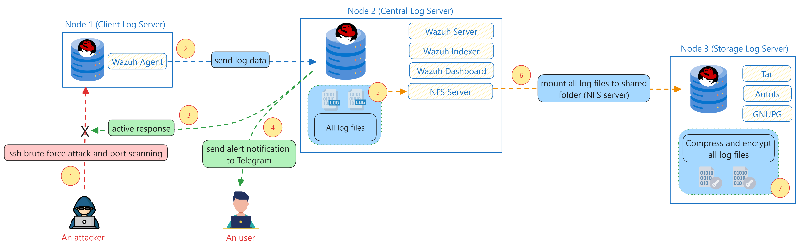

# Cilogs | Centralized Log Server Solution

Sebuah shell script untuk melakukan otomatisasi instalasi dan konfigurasi **Centralized Log Server** menggunakan beberapa open-source tools. Selain itu, terdapat fitur keamanan tambahan, yaitu untuk melakukan active response pada serangan tertentu, yaitu **port scanning dan SSH brute force attacks**. Ditambah lagi dengan integrasi dengan Telegram, sehingga membuat penanganan insiden siber bisa dilakukan lebih cepat oleh tim SOC.

## Spesifikasi yang diperlukan

- RAM: >8GB
- Storage: >500G
- OS: RHEL 9+ (can be as vm or host os)

## Tools yang digunakan

### Node 1

- wazuh-agent

### Node 2

- wazuh-manager
- wazuh-indexer
- wazuh-dashboard
- wazuh-indexer-performance-analyzer
- nfs-utils

### Node 3

- autofs
- gnupg2

## Cara Penggunaan

### 1. Kloning repositori GitHub

```bash
git clone https://github.com/wahyukiddies/cilogs.git
cd cilogs
```

### (Opsional) - Jalankan setup script

Script `setup.sh` dikhususkan bagi kamu yang memiliki resource yang terbatas supaya bisa menjalankan 3 node. Di mana, node 2 berjalan di atas workstation secara langsung. Node 1 dan node 3 akan berjalan di dalam container menggunakan `redhat/ubi9-init` image. Berikut adalah spesifikasi minimum yang diperlukan.

CPU     | RAM | STORAGE |
------- | --- | ------- |
4 cores | 8GB | <80GB   |

Cara menjalankan:

```bash
su - # WAJIB: login sebagai root
chmod a+x setup.sh
./setup.sh
```

**Catatan tambahan**:

- Bagi kamu yang merupakan mentee IL program HCRH dan ingin mencoba skrip ini di lab Timedrills (Workstation), kami menyarankan kamu untuk **menambahkan ukuran RAM: +6G, Storage: +50G, dan kalau bisa tambahkan CPU cores menjadi 4 cores**.
- Setelah itu, buat partisi LVM baru untuk ditambahkan ke root. Dalam hal ini partisi barunya sebesar **+25G** untuk menginstal Wazuh central components. Berikut adalah caranya.

```bash
fdisk /dev/nvme0n1 # -> sesuaikan sama device kamu
n # bikin partisi baru
p # partisi primary
3 # partisi primary ke-3
(enter) # first sector default aja
+25G

t # ganti tipe partisi
3 # ganti tipe partisi primary ke-3
lvm # tipe partisi diubah ke LVM

w # simpan perubahan dan keluar dari mode fdisk
```

- Tambahkan LVM root dengan cara sebagai berikut.

```bash
pvcreate /dev/nvme0n1p3 # sesuaikan sama device kamu
vgextend cs /dev/nvme0n1p3 # sesuaikan sama device kamu
lvextend -r -L +20G /dev/cs/root # tidak bisa full 25G
```

- Jangan lupa untuk me-reload daemon dan mengubah setingan di Kernel.

```bash
systemctl daemon-reload
udevadm settle; partprobe
```

### 2. Jalankan installer script

Sebelum menjalankan skrip _installer_, penting untuk menambahkan konfigurasi pada file `.env` agar dapat berjalan sesuai keinginan.
Beberapa parameter yang penting untuk disesuaikan pada file `.env` antara lain:

- IP_NODE1, IP_NODE2, IP_NODE3
- SSH_PORT_NODE1, SSH_PORT_NODE2, SSH_PORT_NODE3
- ROOT_PASS_NODE1, ROOT_PASS_NODE2, ROOT_PASS_NODE3
- TELEGRAM_API_TOKEN, GROUP_CHAT_ID
- GPG_KEY_NAME, GPG_KEY_MAIL, GPG_KEY_COMMENT, GPG_KEY_PASSPHRASE

Script `install.sh` sendiri berfungsi untuk melakukan otomatisasi proses sentralisasi log server pada 3 node yang telah didefinisikan di file `.env`. Caranya yaitu dengan melakukan SSH ke-3 node dan menjalankan file configuration script.

```bash
su - # WAJIB: login sebagai root
chmod a+x install.sh
./install.sh
```

**Catatan penting**:

- Untuk keperluan testing, saya menyarankan Anda untuk mengubah skrip di dalam `config-files/config-node3.sh` pada fungsi `create_cron_job` untuk dipercepat. Misalnya, 5/10 menit supaya proses kompresi dan enkripsi log file bisa lebih cepat. Contohnya seperti ini.

```bash
*/10 * * * * root tar -czf ${COMPRESSED_LOG_DIR}/backup_log_$(date +%Y%m%d).tar.gz ${BACKUP_MOUNT_POINT}/* && gpg --encrypt --recipient ${GPG_KEY_MAIL} ${COMPRESSED_LOG_DIR}/backup_log_$(date +%Y%m%d).tar.gz
```

## (Opsional) Dekripsi pada compressed log files

Kami sudah menyediakan skrip untuk melakukan dekripsi file-file log yang sudah dikompres dan dienkripsi menggunakan GPG secara otomatis. Berikut adalah caranya.

```bash
su - # jangan lupa login sebagai root
chmod a+x decrypt.sh

# sebelum dieksekusi, pastikan konfigurasi variabel sudah sesuai.
FILE_TO_DECRYPT="/mnt/compressed/backup_logs.tar.gz"
GPG_KEY_RECIPIENT="testing@mail.com"
GPG_KEY_PASSPHRASE="testing123"
OUTPUT_DIR="/mnt/decrypted"

./decrypt.sh
```

## Simulasi Penyerangan Port Scanning dan SSH Brute Force

```bash
chmod +x attacks.py
python3 attacks.py # atau langsung pakai ./attacks.py juga bisa
# > pilih serangan yang ingin dilancarkan (1) untuk port scanning dan (2) untuk ssh brute force
```

## Flowchart / Diagram Sistem



## Video Demonstrasi

Coming soon

## Lampiran Dokumen

1. [Research Paper](https://docs.google.com/document/d/1mPCNVVcSWGiXO0kJXTk8Wg3yfwToL1ag5Z7mYHmOiDo/edit?usp=sharing)
2. [Design Thinking Board](https://miro.com/welcomeonboard/TFFWWTFabEZoVzA4aXlaZnh2bWJVaWpzMWxKaG4yQ24xMzJTeXpTTlVwZjEwZ0hURDdjRk5kdFAybFEwRXEyOXwzNDU4NzY0NjA0MDU0MzUwNTYxfDI=?share_link_id=804140861053)

## Kontributor / Anggota Kelompok

- Adryan Usfirahiman
- Dafi Nafidz Radhiyya
- Jerry Jardian
- Wahyu Priambodo
- Wilsen Lau

---

© 2024 - Infinite Learning Indonesia | MSIB Batch 7
