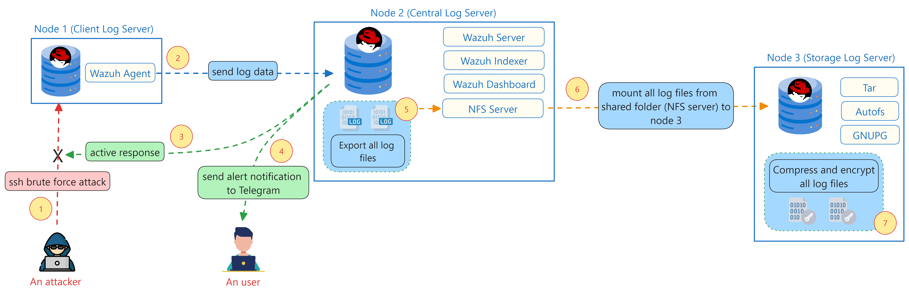

# Cilogs | Centralized Log Server Solution

A shell script to automate the installation and configuration process of Centralized Log Server using several open-source tools, such as **Wazuh, Autofs, and GPG**. Additionally, we're adding security feature to do active response for **SSH brute force attack**, which will **block the attacker connection with Firewalld** and **send the alert notification to user Telegram**. Hopefully, this project will help you to securely centralizing log server.

## I. Required Specifications

- RAM: >= 8GB
- Storage: >= 90GB
- OS: RHEL ver-9.0+ (can be as vm or host os)

## II. Used Tools

### Node 1

- wazuh-agent

### Node 2

- wazuh-manager
- wazuh-indexer
- wazuh-dashboard
- wazuh-indexer-performance-analyzer
- nfs-utils

### Node 3

- autofs
- gnupg2

## III. Usage

### 0. VM's Preparation

- Make sure you prepare 3 RHEL (9.0+) VMs
- We recommend you to setup all nodes / servers with this hardware specification

Node | CPU cores | RAM | Storage |
---- | --------- | --- | ------- |
node1 | 4        | 2GB | >= 20GB |
node2 | 4        | 6GB | >= 50GB |
node3 | 4        | 2GB | >= 20GB |

- For you that have been installed the Timedrills Lab from IL, you need to add new partition in node 2 to extend the root LVM, just follow this step:

```bash
fdisk /dev/nvme0n1 # -> change this according to your disk label name
n # create a new partition
p # create a primary partition
3 # create 3rd primary partition
(enter) # first sector default
+25G

t # change the type of partition
3 # change the 3rd primary partition type
lvm # change the type of 3rd primary partition to LVM

w # save and exit from fdisk mode

pvcreate /dev/nvme0n1p3 # label the created new partition with PV
vgextend cs /dev/nvme0n1p3 # Extend the 'cs' VG with size of labeled partition
lvextend -r -L +20G /dev/cs/root # Extend more +20GB of the 'cs-root' LVM partition

systemctl daemon-reload # reload daemon
udevadm settle; partprobe # just to make sure that the Kernel have know it that the root LVM is extended.

exit # from root
lab validate # make sure that the Lab is still functional.
# WE RECOMMEND TO TAKE SNAPSHOT BEFORE JUMP TO THE NEXT STEP!.
```

### 1. Clone this repository

- You've to clone this repo to get the `install.sh` (installer) script and some important files.

```bash
git clone https://github.com/wahyukiddies/cilogs.git
```

### 2. Configure the environment variable file

- This step is also important to set the all nodes that you want to configure.
- Here's some parameters in the `.env` file that you've to configure:

```txt
IP_NODE1=192.168.241.128
SSH_PORT_NODE1=22
ROOT_PASS_NODE1=redhat
IP_NODE2=192.168.241.134
SSH_PORT_NODE2=22
ROOT_PASS_NODE2=redhat
IP_NODE3=192.168.241.133
SSH_PORT_NODE3=22
ROOT_PASS_NODE3=redhat

TELEGRAM_API_TOKEN=7577658133:AAGGVeqh82OONOKcQxwZ3kzAOGDxNqbRaPc
GROUP_CHAT_ID=-4771858758

BACKUP_MOUNT_POINT=/mnt/backup
COMPRESSED_LOG_DIR=/mnt/compressed
BACKUP_IN_DAYS=1
GPG_KEY_HOME=/root/.gnupg
GPG_KEY_NAME=Testing
GPG_KEY_MAIL=testing@mail.com
GPG_KEY_COMMENT="Testing Purposes" # If the comment have spaces, use doubtle quotes!
GPG_KEY_PASSPHRASE=testing123
```

### 3. Run the installer script

**RECOMMENDATION STEP**:

- If you just want to test the installer script, we recommend you to change the default value `${BACKUP_IN_DAYS}` for backup job, you can set the backup job to per minute / per hour like this:

```bash
* * */${BACKUP_IN_DAYS} * * /root/backup-job.sh

# per minute backup job
*/1 * * * * /root/backup-job.sh
# or per hour
* */1 * * * /root/backup-job.sh
```

- Then, you can run the installer script with the following commands:

```bash
# Add execute permission to all shell script files.
chmod -R +x cilogs/*.sh

# Make sure you inside the `cilogs` dir.
cd cilogs/

# Run the installer script.
./install.sh
```

## IV. Additional Step: Run node 1 and node 3 as container in node 2 (workstation)

- If you've an issue **according to hardware specification**, such as cannot run 3 VM's because lack of RAM, you can run the `setup.sh` script.

```bash
./setup.sh
```

- After the installation of setup script is done, you can communicate to node 1 and node 3 via node 2 using `192.168.1.0/24` network.
  - Node 1: **192.168.1.2/24**
  - Node 2: **192.168.1.1/24**
  - Node 3: **192.168.1.3/24**
- You can check the IP of node 1 and node 3 using this command:

```bash
podman exec -it node1-ctr ip -br a
podman exec -it node3-ctr ip -br a
```

- If you've a problem of **container 1 or container 3 cannot connect to internet**, make sure your **workstation (node 2) is connected to internet**.
- If it's still error, **you can restart the container** with this command:

```bash
podman restart node{1,3}-ctr # Choose the container that have internet issue

# Testing
podman exec -it node{1,3}-ctr ping google.com # Choose the container that have internet issue
```

## V. Additional Step: Decrypt the encrypted log files

- Use the following command to **decrypt the encrypted log files** located in your `COMPRESSED_LOG_DIR`.

```bash
gpg --batch --yes --output ${OUTPUT_FILENAME} --decrypt ${COMPRESSED_LOG_FILE}
# Replace the ${OUTPUT_FILENAME} with the decrypted file name
# Replace the ${COMPRESSED_LOG_FILE} with the compressed log files, maybe located in /mnt/compressed in default
```

## VI. SSH Brute Force Attack Simulation

- We provide a simple Python script to **performing SSH brute force attack**, just run with the following command:

```sh
python attacks.py  # For Windows
python3 attacks.py # For Linux/Mac

# > Enter the IP address of target machine (node 1): 192.168.241.128
# > Enter the SSH port that the target machine (node 1) used: 22 (default)
```

## VII. Flowchart / System Diagram



## VIII. Showcase Video

[Showcase Video Link](https://drive.google.com/file/d/1I-DWR-QgCjqltJm6JWp_T122mnSq_0K9/view?usp=drivesdk)

## IX. Document Attachments

1. [Research Paper](https://docs.google.com/document/d/1mPCNVVcSWGiXO0kJXTk8Wg3yfwToL1ag5Z7mYHmOiDo/edit?usp=sharing)
2. [Design Thinking Board](https://miro.com/welcomeonboard/TFFWWTFabEZoVzA4aXlaZnh2bWJVaWpzMWxKaG4yQ24xMzJTeXpTTlVwZjEwZ0hURDdjRk5kdFAybFEwRXEyOXwzNDU4NzY0NjA0MDU0MzUwNTYxfDI=?share_link_id=804140861053)

## X. Contributors / Cilogs Team Members

- Adryan Usfirahiman
- Dafi Nafidz Radhiyya
- Jerry Jardian
- Wahyu Priambodo (team leader)
- Wilsen Lau

---

© 2024 - Infinite Learning Indonesia | MSIB Batch 7
